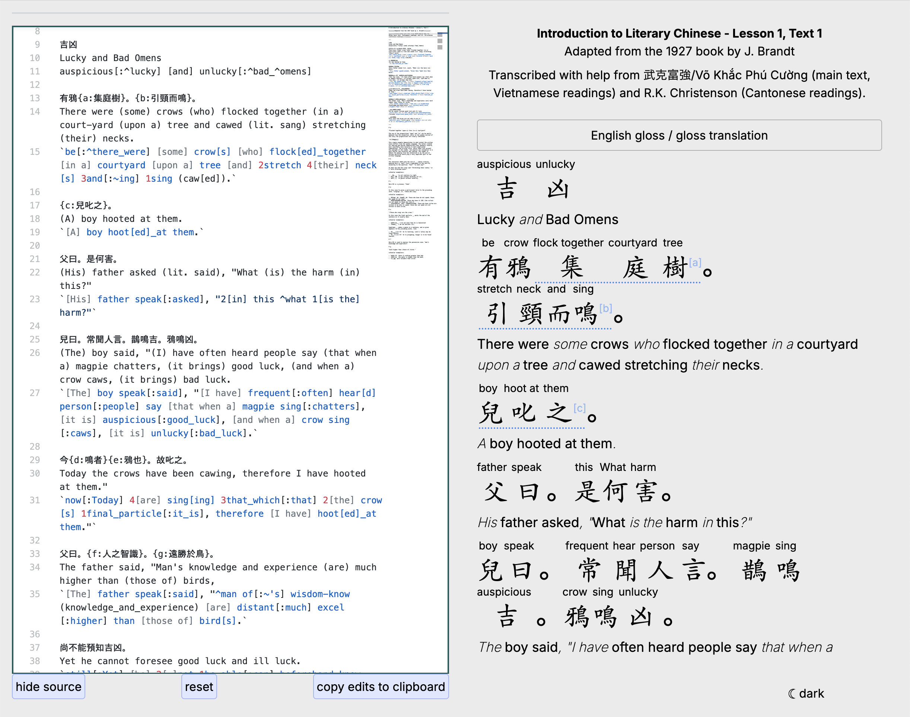

# hanlib

This is a project to make a library of free interactive texts for learners of classical/literary Chinese.

# features

Texts are shown with an interactive English translation. **Click on any character** to see its English translations in a pop-up dictionary, with its **meaning in the current context** highlighted explicitly, to make texts easy to understand.

Words and set expressions **consisting of multiple characters** are glossed as well.

This all works through a **domain-specific language** for glossing Chinese texts. It is inspired by the conventions of [_kanbun kundoku_](https://en.wikipedia.org/wiki/Kanbun), a traditional Japanese technique for translating and glossing classical/literary Chinese texts.

A variety of pronunciation schemes are available to choose from, so as to make Hanlib a valuable resource for people throughout the [Sinosphere](https://en.wikipedia.org/wiki/Sinosphere) and beyond.

# current focus

The current focus is to transcribe + format the content of the 1927 textbook _Introduction to Literary Chinese_ by J. Brandt. This book is in the public domain in the US. You can access a digitized copy from a US IP address here:

- This copy hosted on archive.org is missing some pages and has some early pages cut off, but the pages are generally with fewer manual markings. https://archive.org/details/introductiontoli00branuoft
- This scanned copy from HathiTrust is complete but has lots of pencil notes, which make OCR more difficult. https://babel.hathitrust.org/cgi/pt?id=ucbk.ark:/28722/h23r0qb76

The biggest challenge at the moment is transcribing the portions in mixed Chinese/Latin script. OCR tools can automate some of the process, but not all of it. If you have time, please consider helping out by transcribing the remaining "Vocabulary" and "Notes" chapters listed [here](./docs/brandt.md).

## texts &nbsp;&nbsp;[![CC BY-NC-SA 4.0][cc-by-nc-sa-shield]][cc-by-nc-sa]

The following license information applies to the texts in the [texts](./texts) folder.

[Creative Commons Non-Commercial Attribution-ShareAlike 4.0 International License][cc-by-nc-sa].

[![CC BY-NC-SA 4.0][cc-by-nc-sa-image]][cc-by-nc-sa]

[cc-by-nc-sa]: http://creativecommons.org/licenses/by-nc-sa/4.0/
[cc-by-nc-sa-image]: https://licensebuttons.net/l/by-nc-sa/4.0/88x31.png
[cc-by-nc-sa-shield]: https://img.shields.io/badge/License-CC%20BY--NC--SA%204.0-lightgrey.svg

## development

To run the app locally:

1. Install packages from the repository root directory
   > npm install
2. Run prebuild script
   > npm run prebuild
3. Run Next.js dev server
   > npm run dev

After making changes to the files in the `texts/` directory, you may need to **run the prebuild script again**.
