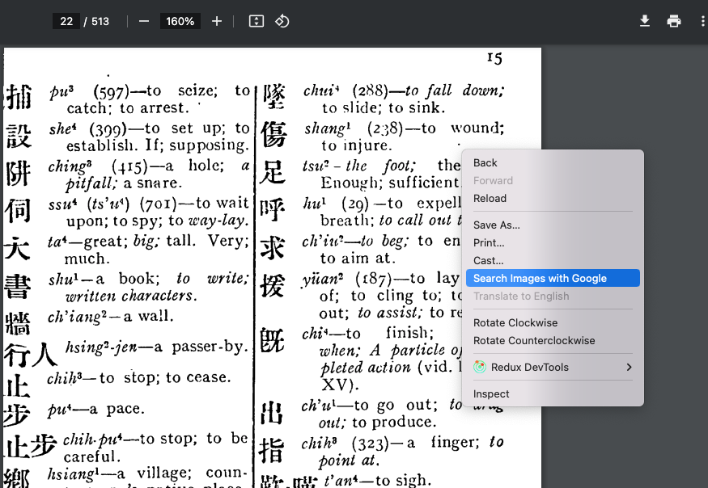
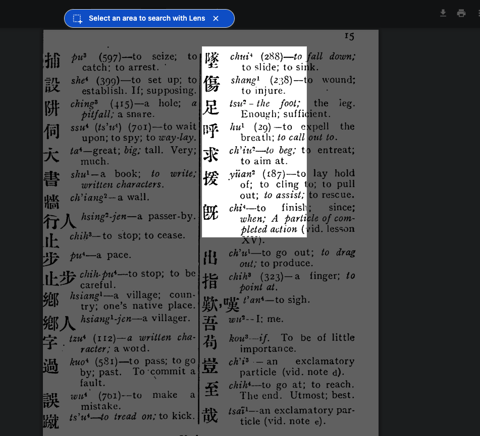
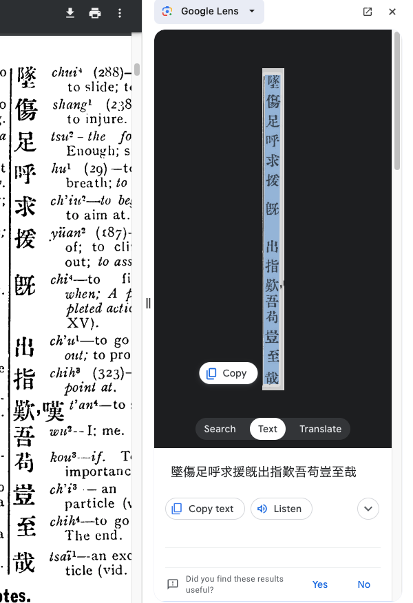

# Transcribing text from a scanned PDF with automated Optical Character Recognition (OCR)

As of March 2024, the best free tool _that I'm aware of_ for transcribing text from a scanned PDF is Google Lens via Google Chrome browser. It offers the some rare functionality for OCR tools, such as handling vertical Chinese text, and it even does relatively well _at times_ with mixed Chinese/Latin script.

If you want to [help transcribing text from _Introduction to Literary Chinese_][./brandt], this copy from archive.org is relatively free of manual markings, so I recommend it:

https://archive.org/details/introductiontoli00branuoft

It already has embedded text, presumably produced via some OCR tool, but it is full of errors. However, it is possible to get more accurate text with the free OCR in Google Lens.

## Step-by-step: using Google Lens for OCR via Chrome browser

**I have only tried this on Mac**, but I suspect it works mostly the same on any device capable of running Google Chrome.

Before starting, it goes without saying that you need to open the file in Chrome. In your filesystem navigator, find the downloaded PDF file and open it in Chrome. For Mac, this means right/Ctrl-clicking on the file and choosing to "Open with" Chrome.

### Step 1: Activate Google Lens

In the Google Chrome PDF viwer, find the page you wish to transcribe. Then, making sure **no text in the PDF is currently selected**, right/Ctrl-click on an empty-looking portion of the PDF, and choose "Search images with Google".

### Step 2: Select text to transcribe with Google Lens

Now you should see a prompt to "Select an area to search with Lens". Follow the prompt, i.e. drag the mouse to make a rectangle covering **only the text you wish to transcribe**. In areas with complex layouts, it is better to choose **smaller areas** to minimize OCR errors.

### Step 3: Copy the OCR'd text

A side panel will open up showing the OCR'd text. It is easiest (but not necessary) if you click the "Text" button before selecting the text you wish to copy.

For some reason, on my computer, **keyboard shortcuts to copy text do not work in Google Lens**. Instead, I have to use the "Copy" button that pops up after you select the text.

### Step 4: Paste and proofread the text, and repeat as needed with smaller portions

Now you can use the text in your text editor of choice. The OCR will often make mistakes in recognizing characters, and sometimes it will put lines/words out of order. In this example, the OCR did not pick up the Chinese text very well. Other times, it picks up both English and Chinese text fine, so it's often a matter of luck.

However, when something like this happens, following steps 1-3 on **a smaller portion of text**. If we try **just the Chinese portion** here, it picks up the characters flawlessly.

